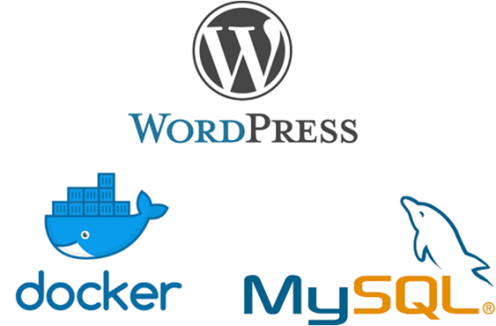

<h1 align="center"> Tarefa 02 do Estágio Compass.uol</h1>
<center>

</center>
<h3>Subindo uma aplicação Wordpress + DB Mysql utilizando Docker: instalação</h3>
<!–# Tarefa 02 do Estágio Compass.uol Docker 

Para dar início ao nosso Container Docker com wordpress e Mysql iremos atualizar os pacotes da máquina Oracle Linux 8.6:

```apt-get update```

Em seguida, iremos instalar o Docker através do seguinte comando:

```apt-get -y install docker.io```

Após a instalação do docker será necessário instalar o docker-compose, pois é um conteúdo aparte do docker e que iremos utilizar para configurar o nosso container.
 Para instalação usamos o comando:
 
 ```sudo apt install docker-compose```
 
 e podemos verificar sua instalação com o comando:
 
 ```docker-compose --version```

Para iniciar o nosso container primeiro criamos uma pasta no diretório /:

```mkdir wordpress```

nesta pasta iremos criar nosso arquivo "docker-compose.yml", com as seguintes linhas de código:

```
version: '3'

services:
   db:
     image: mysql:5.7
     volumes:
       - db_data:/var/lib/mysql
     restart: always
     environment:
       MYSQL_ROOT_PASSWORD: wordpassr
       MYSQL_DATABASE: wordpress
       MYSQL_USER: worduser
       MYSQL_PASSWORD: wordpass

   wordpress:
     depends_on:
       - db
     image: wordpress:latest
     ports:
       - "80:80"
     restart: always
     environment:
       WORDPRESS_DB_HOST: db:3306
       WORDPRESS_DB_USER: worduser
       WORDPRESS_DB_PASSWORD: wordpass
volumes:
    db_data:
```

Os códigos que usamos nesse arquivo tem seu significado da seguinte forma:

```version: A versão do docker-compose```

```image: A imagem que vamos baixar do dockerhub```

```volumes: Pastas que serão criadas localmente ```

```db_data: volume e caminho da pasta que sera criada```

```restart: Define se se o container será reiniciado em caso de erro```

```enviroment: Lista as variaveis de ambiente utilizadas pelo container```

```MYSQL_ROOT_PASSWORD:Definimos uma senha para o usuário root```

```MYSQL_DATABASE: Nome do database que vamos criar```

```MYSQL_USER: Nome do usuário que terá acesso ao database```

```MYSQL_PASSWORD: Senha do usuário```

Neste ponto você ja configurou o seu Mysql, agora pode seguir para configurar o Wordpress:

```wordpress: Serviço que vamos utilizar(WordPress)```

```depends_on: Cria a dependência entre o serviço do WordPress em relação ao banco de dados(db)```

```image: selecione a imagem do repositório do WordPress no dockerhub(utilizamos a latest, que é a versão mais nova disponível)```

```ports: Lista as portas que tem acesso da máquina local para o container criado```

```80:80: A porta da máquina local será a 80 e a porta da máquina do container será 80```

```restart: Define se se o container será reiniciado em caso de erro```

```environment: Lista as variaveis de ambiente utilizadas pelo container```

```WORDPRESS_DB_HOST: criamos o nome do Host para acessar ao MySql```

```WORDPRESS_DB_USER: criamos o nome do usuário para acessar o banco de dados no MySql```

```WORDPRESS_DB_PASSWORD: criamos a senha do usuário para acessar o banco de dados no MySql.```


Por último, rodaremos o nosso container com o seguinte comando:

```docker-compose up -d```

E para verificar seu funcionamento acessamos através do https://localhost:80
